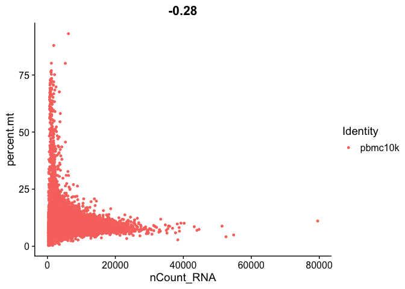
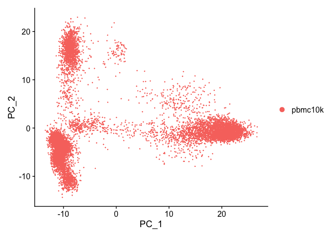
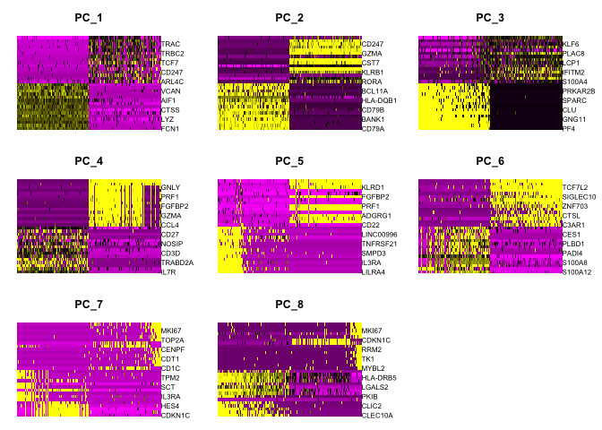

    library(dplyr)

    ## 
    ## Attaching package: 'dplyr'

    ## The following objects are masked from 'package:stats':
    ## 
    ##     filter, lag

    ## The following objects are masked from 'package:base':
    ## 
    ##     intersect, setdiff, setequal, union

    library(ggplot2)
    library(Seurat)

Data
----

Source of Single Cell RNA - seq dataset is
[here](https://support.10xgenomics.com/single-cell-gene-expression/datasets)
In this set, I am using 10k PBMCs from a Healthy Donor (v3 chemistry)
dataset from Cell Ranger 3.0.

    pbmc.data<- Read10X(data.dir = "/Users/valentinastoma/DataSci_practice/SingleCell_RNA_seq/raw_feature_bc_matrix")

    pbmc.filtered <- CreateSeuratObject(counts = pbmc.data, project = "pbmc10k", assay = "RNA", min.cells = 3, min.features = 200)
    pbmc.filtered

    ## An object of class Seurat 
    ## 20304 features across 11938 samples within 1 assay 
    ## Active assay: RNA (20304 features)

Quality Control
---------------

### Mitochondrial genes

    # calculate the percentage of counts originating from a set of features
    # only using mitochondrial genes for this search, we we want the proportion of mt genes in the sample
    pbmc.filtered[["percent.mt"]] <- PercentageFeatureSet(pbmc.filtered, pattern = "^MT-")

    # Automatically generate QC data from the CreateSeuratObject 
    head(pbmc.filtered@meta.data, 5)

    ##                  orig.ident nCount_RNA nFeature_RNA percent.mt
    ## AAACCCAAGCGCCCAT    pbmc10k       2204         1087   2.359347
    ## AAACCCAAGGTTCCGC    pbmc10k      20090         4200   6.590343
    ## AAACCCACAGACAAGC    pbmc10k        478          283   5.857741
    ## AAACCCACAGAGTTGG    pbmc10k       5884         1836  10.757988
    ## AAACCCACAGGTATGG    pbmc10k       5530         2216   7.848101

In the example below, we visualize QC metrics, and use these to filter
cells.

We filter cells that have unique feature counts over 2,500 or less than
200 We filter cells that have &gt;5% mitochondrial counts

    # Visualize QC metrics as a violin plot
    VlnPlot(pbmc.filtered, features = c("nFeature_RNA", "nCount_RNA", "percent.mt"), ncol = 3)

    # FeatureScatter is typically used to visualize feature-feature relationships, but can be used
    # for anything calculated by the object, i.e. columns in object metadata, PC scores etc.

    plot1_filtered <- FeatureScatter(pbmc.filtered, feature1 = "nCount_RNA", feature2 = "percent.mt")
    plot2_filtered <- FeatureScatter(pbmc.filtered, feature1 = "nCount_RNA", feature2 = "nFeature_RNA")
    plot1_filtered 

    plot2_filtered

Data Subset
-----------

    # Subsetting the data based on the quality control performed above 
    pbmc.filtered <- subset(pbmc.filtered, subset = nFeature_RNA > 200 & nFeature_RNA < 5800 & percent.mt < 30)

    # Normalization through standard log method. Although there are other normalization techniques that can be applied to Single
    # Cell RNA - Seq, 
    pbmc.filtered <- NormalizeData(pbmc.filtered, normalization.method = "LogNormalize", scale.factor = 10000)

    pbmc.filtered <- FindVariableFeatures(pbmc.filtered, selection.method = "vst", nfeatures = 2000)

    # Identify the 10 most highly variable genes
    top10_filtered <- head(VariableFeatures(pbmc.filtered), 10)
    top10_filtered

    ##  [1] "PPBP"   "PF4"    "JCHAIN" "PTGDS"  "IGKC"   "LYPD2"  "MZB1"   "CAVIN2"
    ##  [9] "IGHA1"  "FCER1A"

    # plot variable features with and without labels
    plot1_variability <- VariableFeaturePlot(pbmc.filtered)
    plot2_variability <- LabelPoints(plot = plot1_variability, points = top10_filtered, repel = TRUE)

    ## Warning: Using `as.character()` on a quosure is deprecated as of rlang 0.3.0.
    ## Please use `as_label()` or `as_name()` instead.
    ## This warning is displayed once per session.

    ## When using repel, set xnudge and ynudge to 0 for optimal results

    plot1_variability

    # with the top 10 genes labels 
    plot2_variability

Scaling data for subsequent PCA
-------------------------------

    #all.genes <- rownames(pbmc.filtered)
    pbmc.filtered_onlyvar <- ScaleData(pbmc.filtered)

    ## Centering and scaling data matrix

PCA
---

    pbmc.filtered_onlyvar<- RunPCA(pbmc.filtered_onlyvar, features = VariableFeatures(object = pbmc.filtered_onlyvar))

    ## PC_ 1 
    ## Positive:  FCN1, MNDA, CST3, LYZ, FGL2, S100A9, CTSS, CSTA, PSAP, AIF1 
    ##     SERPINA1, NCF2, VCAN, GRN, TYMP, S100A8, TYROBP, MS4A6A, CYBB, LGALS1 
    ##     MPEG1, LST1, CD14, CPVL, S100A12, CD68, CLEC7A, KLF4, FTL, CFD 
    ## Negative:  LTB, CD3E, TRAC, CD3D, IL32, TRBC2, IL7R, CD3G, TCF7, ISG20 
    ##     CD69, CD247, CD27, CD7, ARL4C, SPOCK2, CD2, BCL11B, GZMM, TRBC1 
    ##     SYNE2, RORA, FCMR, LAT, NOSIP, IKZF3, LINC00861, CTSW, ZAP70, KLRB1 
    ## PC_ 2 
    ## Positive:  CD79A, MS4A1, IGHM, BANK1, IGHD, HLA-DQA1, CD79B, LINC00926, CD22, HLA-DQB1 
    ##     CD74, TNFRSF13C, BCL11A, TCL1A, RALGPS2, HLA-DRB1, HLA-DRA, HLA-DPB1, IGKC, FAM129C 
    ##     VPREB3, HLA-DPA1, SPIB, HLA-DQA2, FCER2, HLA-DRB5, MEF2C, FCRL5, SWAP70, FCRL2 
    ## Negative:  IL32, GZMM, CD247, CD7, CTSW, GZMA, CD3E, NKG7, CST7, S100A4 
    ##     PRF1, KLRB1, CD3D, ANXA1, RORA, KLRG1, SAMD3, ARL4C, TRAC, KLRD1 
    ##     GNLY, IL7R, CD3G, ZAP70, CCL5, TRBC1, MATK, CD2, SYNE2, IL2RB 
    ## PC_ 3 
    ## Positive:  PF4, TUBB1, CAVIN2, GNG11, GP9, PPBP, CLU, CMTM5, TREML1, SPARC 
    ##     ACRBP, ITGA2B, PRKAR2B, CTTN, CD9, HIST1H2AC, NRGN, MYL9, PTCRA, AC147651.1 
    ##     MTURN, MPIG6B, CLDN5, MAP3K7CL, TMEM40, TSC22D1, AP001189.1, F13A1, PGRMC1, CLEC1B 
    ## Negative:  CYBA, LTB, KLF6, PPIB, VIM, PLAC8, NEAT1, CALR, LCP1, HMGN2 
    ##     LY6E, IFITM2, ISG20, ARL4C, S100A4, CD69, SEC61B, S100A6, CD74, S100A10 
    ##     PRELID1, FOS, DUSP1, GZMM, CD247, CD7, IL32, APOBEC3G, SUB1, TRBC2 
    ## PC_ 4 
    ## Positive:  IL7R, TCF7, MAL, TRABD2A, LEF1, CD3G, CD3D, TRAC, CCR7, NOSIP 
    ##     SLC2A3, CAMK4, CD27, PASK, LTB, BCL11B, INPP4B, TSHZ2, NELL2, RGCC 
    ##     VIM, TRAT1, CD40LG, AQP3, FHIT, ADTRP, CD3E, CD28, RGS10, EGR1 
    ## Negative:  GZMB, CLIC3, GNLY, KLRF1, NKG7, PRF1, KLRD1, SPON2, FGFBP2, CST7 
    ##     ADGRG1, GZMA, TRDC, HOPX, CCL4, IL2RB, CTSW, TTC38, FCGR3A, GZMH 
    ##     MYOM2, TBX21, AKR1C3, RHOC, MATK, APOBEC3G, CD160, C12orf75, S1PR5, SH2D1B 
    ## PC_ 5 
    ## Positive:  LILRA4, SERPINF1, CLEC4C, IL3RA, SCT, TPM2, SMPD3, DNASE1L3, LRRC26, TNFRSF21 
    ##     SCN9A, PLD4, LINC00996, GAS6, RHEX, ITM2C, SCAMP5, LAMP5, ZFAT, DERL3 
    ##     UGCG, KCNK17, PHEX, CYP46A1, PACSIN1, AC119428.2, PPM1J, SHD, ASIP, PPP1R14B 
    ## Negative:  GNLY, KLRF1, KLRD1, MS4A1, CD79B, FGFBP2, CD79A, LINC00926, PRF1, NKG7 
    ##     IGHD, ADGRG1, CCL4, SPON2, CD22, CST7, TRDC, BANK1, HOPX, TNFRSF13C 
    ##     MYOM2, FCER2, GZMH, GZMA, TTC38, RALGPS2, TBX21, VPREB3, CD160, IL2RB

    print(pbmc.filtered_onlyvar[["pca"]], dims = 1:5, nfeatures = 5)

    ## PC_ 1 
    ## Positive:  FCN1, MNDA, CST3, LYZ, FGL2 
    ## Negative:  LTB, CD3E, TRAC, CD3D, IL32 
    ## PC_ 2 
    ## Positive:  CD79A, MS4A1, IGHM, BANK1, IGHD 
    ## Negative:  IL32, GZMM, CD247, CD7, CTSW 
    ## PC_ 3 
    ## Positive:  PF4, TUBB1, CAVIN2, GNG11, GP9 
    ## Negative:  CYBA, LTB, KLF6, PPIB, VIM 
    ## PC_ 4 
    ## Positive:  IL7R, TCF7, MAL, TRABD2A, LEF1 
    ## Negative:  GZMB, CLIC3, GNLY, KLRF1, NKG7 
    ## PC_ 5 
    ## Positive:  LILRA4, SERPINF1, CLEC4C, IL3RA, SCT 
    ## Negative:  GNLY, KLRF1, KLRD1, MS4A1, CD79B

### Gene and Feature visualization of the PCA results

    DimPlot(pbmc.filtered_onlyvar, reduction = "pca")

“In particular DimHeatmap allows for easy exploration of the primary
sources of heterogeneity in a dataset, and can be useful when trying to
decide which PCs to include for further downstream analyses. Both cells
and features are ordered according to their PCA scores. Setting cells to
a number plots the ‘extreme’ cells on both ends of the spectrum, which
dramatically speeds plotting for large datasets. Though clearly a
supervised analysis, we find this to be a valuable tool for exploring
correlated feature sets.”

    DimHeatmap(pbmc.filtered_onlyvar, dims = 1, cells = 500, balanced = TRUE)

    DimHeatmap(pbmc.filtered_onlyvar, dims = 1:8, cells = 500, balanced = TRUE)

    VizDimLoadings(pbmc.filtered_onlyvar, dims = 1:2, reduction = "pca")

Determine the dimensionality of the dataset
-------------------------------------------

To overcome the extensive technical noise in any single feature for
scRNA-seq data, Seurat clusters cells based on their PCA scores, with
each PC essentially representing a ‘metafeature’ that combines
information across a correlated feature set. The top principal
components therefore represent a robust compression of the dataset.
However, how many componenets should we choose to include? 10? 20? 100?

We implemented a resampling test inspired by the JackStraw procedure. We
randomly permute a subset of the data (1% by default) and rerun PCA,
constructing a ‘null distribution’ of feature scores, and repeat this
procedure. We identify ‘significant’ PCs as those who have a strong
enrichment of low p-value features.

    # NOTE: This process can take a long time for big datasets, comment out for expediency. More
    # approximate techniques such as those implemented in ElbowPlot() can be used to reduce
    # computation time
    pbmc.filtered_onlyvar <- JackStraw(pbmc.filtered_onlyvar, num.replicate = 100)
    pbmc.filtered_onlyvar <- ScoreJackStraw(pbmc.filtered_onlyvar, dims = 1:20)

Visualization of the estimates of principle component analysis. This
plot demonstrates how much of standard deviation in the dataset is
explained by a number of principle components. In case of single cell
RNA -seq, it is more safe to stay on the higher side of the PCA that one
proceeds with in the analysis in order to not loose significant gene
expression analysis. In this dataset, we proceed with 10 components.

    ElbowPlot(pbmc.filtered_onlyvar)

Clustering
----------

First construct a K nearest neighbor graph based on the euclidean
distance in PCA space, and refine the edge weights between any two cells
based on the shared overlap in their local [neighborhoods (Jaccard
similarity)](https://satijalab.org/seurat/v3.1/pbmc3k_tutorial.html).
Clustering is achieved through modularity optimization techniques such
as the [Louvain
algorithm](https://www.nature.com/articles/s41598-019-41695-z) (default)
or SLM.

    pbmc.filtered_onlyvar <- FindNeighbors(pbmc.filtered_onlyvar, dims = 1:10)

    ## Computing nearest neighbor graph

    ## Computing SNN

    pbmc.filtered_onlyvar <- FindClusters(pbmc.filtered_onlyvar, resolution = 0.5)

    ## Modularity Optimizer version 1.3.0 by Ludo Waltman and Nees Jan van Eck
    ## 
    ## Number of nodes: 11629
    ## Number of edges: 393047
    ## 
    ## Running Louvain algorithm...
    ## Maximum modularity in 10 random starts: 0.9199
    ## Number of communities: 16
    ## Elapsed time: 1 seconds

Uniform Manifold Approximation and Projection (UMAP) is a
recently-published non-linear dimensionality reduction technique.using
UMAP avoids overcrowding issues which is encountered in PCA

t-SNE is another methods for non-linear dimensionality reduction
technique but is not used here - as some previous research has
demonstrated better efficiency by UMAP DR

    pbmc.filtered_onlyvar<- RunUMAP(pbmc.filtered_onlyvar, dims = 1:10)

    ## Warning: The default method for RunUMAP has changed from calling Python UMAP via reticulate to the R-native UWOT using the cosine metric
    ## To use Python UMAP via reticulate, set umap.method to 'umap-learn' and metric to 'correlation'
    ## This message will be shown once per session

    ## 13:10:06 UMAP embedding parameters a = 0.9922 b = 1.112

    ## 13:10:06 Read 11629 rows and found 10 numeric columns

    ## 13:10:06 Using Annoy for neighbor search, n_neighbors = 30

    ## 13:10:06 Building Annoy index with metric = cosine, n_trees = 50

    ## 0%   10   20   30   40   50   60   70   80   90   100%

    ## [----|----|----|----|----|----|----|----|----|----|

    ## **************************************************|
    ## 13:10:09 Writing NN index file to temp file /var/folders/kp/ysy8n1l97bq5787g2vx8mhsh0000gn/T//RtmpreF6q8/file147b6f293754
    ## 13:10:09 Searching Annoy index using 1 thread, search_k = 3000
    ## 13:10:13 Annoy recall = 100%
    ## 13:10:18 Commencing smooth kNN distance calibration using 1 thread
    ## 13:10:21 Initializing from normalized Laplacian + noise
    ## 13:10:22 Commencing optimization for 200 epochs, with 477180 positive edges
    ## 13:10:32 Optimization finished

To analyze global transcriptional interrelationships, we used
multidimensional scaling to represent the degree of similarity among the
cells in the data set

UMAP on the other hand does preserve global structure and since
distances are preserved, it also tends to preserve continuity of cell
states. Uniform Manifold Approximation and Projection (UMAP) is a
recently-published non-linear dimensionality reduction technique.

    # note that you can set `label = TRUE` or use the LabelClusters function to help label
    # individual clusters
    DimPlot(pbmc.filtered_onlyvar, reduction = "umap", label = TRUE)

Cluster Markers adn Biomarkers
------------------------------

    # find all markers of cluster 1
    cluster1.markers <- FindMarkers(pbmc.filtered_onlyvar, ident.1 = 1, min.pct = 0.25)
    head(cluster1.markers, n = 5)

    ##         p_val avg_logFC pct.1 pct.2 p_val_adj
    ## S100A9      0  2.379413 1.000 0.646         0
    ## S100A8      0  2.361678 1.000 0.526         0
    ## S100A12     0  2.230889 0.999 0.245         0
    ## VCAN        0  1.882940 0.998 0.248         0
    ## LYZ         0  1.810427 1.000 0.695         0

    # find all markers distinguishing cluster 5 from clusters 0 and 3
    cluster5.markers <- FindMarkers(pbmc.filtered_onlyvar, ident.1 = 5, ident.2 = c(0, 3), min.pct = 0.25)
    head(cluster5.markers, n = 5)

    ##       p_val avg_logFC pct.1 pct.2 p_val_adj
    ## NKG7      0  2.193841 0.992 0.138         0
    ## KLRB1     0  1.897115 0.981 0.351         0
    ## GZMA      0  1.654813 0.973 0.178         0
    ## GZMK      0  1.553540 0.967 0.139         0
    ## PRF1      0  1.323332 0.804 0.086         0

    # find markers for every cluster compared to all remaining cells, report only the positive ones
    pbmc.markers_filtered <- FindAllMarkers(pbmc.filtered_onlyvar, only.pos = TRUE, min.pct = 0.25, logfc.threshold = 0.25)

    ## Calculating cluster 0

    ## Calculating cluster 1

    ## Calculating cluster 2

    ## Calculating cluster 3

    ## Calculating cluster 4

    ## Calculating cluster 5

    ## Calculating cluster 6

    ## Calculating cluster 7

    ## Calculating cluster 8

    ## Calculating cluster 9

    ## Calculating cluster 10

    ## Calculating cluster 11

    ## Calculating cluster 12

    ## Calculating cluster 13

    ## Calculating cluster 14

    ## Calculating cluster 15

    pbmc.markers_filtered %>% group_by(cluster) %>% top_n(n = 2, wt = avg_logFC)

    ## # A tibble: 32 x 7
    ## # Groups:   cluster [16]
    ##    p_val avg_logFC pct.1 pct.2 p_val_adj cluster gene  
    ##    <dbl>     <dbl> <dbl> <dbl>     <dbl> <fct>   <chr> 
    ##  1     0     1.33  0.914 0.307         0 0       IL7R  
    ##  2     0     1.13  0.943 0.348         0 0       IL32  
    ##  3     0     2.38  1     0.646         0 1       S100A9
    ##  4     0     2.36  1     0.526         0 1       S100A8
    ##  5     0     0.966 0.889 0.331         0 2       TCF7  
    ##  6     0     0.899 0.67  0.142         0 2       CCR7  
    ##  7     0     2.84  1     0.121         0 3       IGHM  
    ##  8     0     2.50  0.942 0.03          0 3       TCL1A 
    ##  9     0     1.31  0.995 0.283         0 4       CPVL  
    ## 10     0     1.31  0.982 0.212         0 4       LGALS2
    ## # … with 22 more rows

“roc” : Identifies ‘markers’ of gene expression using ROC analysis. For
each gene, evaluates (using AUC) a classifier built on that gene alone,
to classify between two groups of cells. An AUC value of 1 means that
expression values for this gene alone can perfectly classify the two
groupings (i.e. Each of the cells in cells.1 exhibit a higher level than
each of the cells in cells.2). An AUC value of 0 also means there is
perfect classification, but in the other direction. A value of 0.5
implies that the gene has no predictive power to classify the two
groups. Returns a ‘predictive power’ (abs(AUC-0.5) \* 2) ranked matrix
of putative differentially expressed genes.

    cluster1.markers <- FindMarkers(pbmc.filtered_onlyvar, ident.1 = 0, logfc.threshold = 0.25, test.use = "roc", only.pos = TRUE)

    RidgePlot(pbmc.filtered_onlyvar, features = c("LGALS2", "S100A9" ), ncol  = 3)

    ## Picking joint bandwidth of 0.0686

    ## Picking joint bandwidth of 0.212

    # you can plot raw counts as well
    VlnPlot(pbmc.filtered_onlyvar, features = c("NKG7", "PF4"), slot = "counts", log = TRUE)

    # you can plot raw counts as well
    VlnPlot(pbmc.filtered_onlyvar, features = c("LGALS2", "S100A9"), slot = "counts", log = TRUE)

    FeaturePlot(pbmc.filtered_onlyvar, features = c("MS4A1", "GNLY", "CD3E", "CD14", "FCER1A", "FCGR3A", "LYZ", "PPBP", 
        "CD8A"))

Generate an expression heatmap for given cells and features. In this
case, we are plotting the top 20 markers (or all markers if less than
20) for each cluster.

    top10 <- pbmc.markers_filtered %>% group_by(cluster) %>% top_n(n = 10, wt = avg_logFC)
    DoHeatmap(pbmc.filtered_onlyvar, features = top10$gene)

    ## Warning in DoHeatmap(pbmc.filtered_onlyvar, features = top10$gene): The
    ## following features were omitted as they were not found in the scale.data slot
    ## for the RNA assay: PIK3IP1, LDHB

    new.cluster.ids <- c("B_T_cells", 

    "Immune_tumor", 

    "Differentiation", 

    "Immune_macrophages", 
    "Immunoglobulin", 

    "Cytokines", 

    "cell_mediated_immunity", 

    "B_T_cells", 

    "Immunoglobulin_A", 

    "Cytokines", 

    "Immunoglobulin_Gamma", 

    "HLA_complex", 

    "Platelette", 

    "B_cells", 

    "Lymphoid and gastro tissue", 

    "Metastasis_free_marker", 

    "medulloblastoma", 

    "PI3K pathway")
    names(new.cluster.ids) <- levels(pbmc.filtered_onlyvar)
    pbmc.filtered_onlyvar <- RenameIdents(pbmc.filtered_onlyvar, new.cluster.ids)

    ## Warning: Cannot find identity NA

    ## Warning: Cannot find identity NA

    DimPlot(pbmc.filtered_onlyvar, reduction = "umap", label = TRUE, pt.size = 0.5) + NoLegend()

CD79a and CD79b. for b cells

    VlnPlot(pbmc.filtered_onlyvar, features = c("CD79A", "CD79B"), slot = "counts", log = TRUE)

